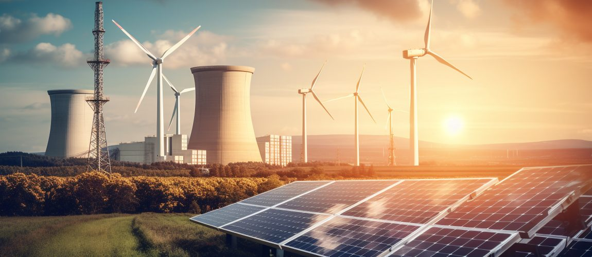

# GLOBAL POWER ANALYSIS

## Introduction
In the pursuit of sustainable energy solutions, renewable energy stands as a beacon of hope for decarbonizing our energy systems. This project delves into the realm of renewable energy to analyze global data, providing insights into its current contributions and evolution. Our aim is to illuminate the path towards a sustainable energy future, enriching our collective understanding of renewable energy infrastructure worldwide.

## Imported Libraries
- pandas
- matplotlib.pyplot
- seaborn
- numpy
- pickle
- datetime
- math

## Business Understanding
The Global Renewable Energy Generation and Capacity Analysis project aims to decode the complexities of the global renewable energy landscape. By exploring various renewable energy sources, their capacities, and contributions, the project offers a comprehensive overview. Stakeholders, policymakers, and investors can leverage these insights for informed decision-making in this vital sector.

## Stakeholders benefiting from this analysis:
- Power generation companies: Strategic planning
- Environmental Agencies: Providing environmental impact assessment
- Researchers and Academia: Contributing to advancements in energy studies
- Local communities: Informed community engagement
- Technology providers: Market identification and growth opportunities
- Government and Regulatory Bodies: Informed decision making
- Energy companies and investors looking for opportunities in the renewable energy market.

## Problem Statement
With fossil fuels dominating the energy mix, there's a pressing need to transition to low-carbon alternatives. However, existing analyses often fail to translate data into actionable insights for stakeholders. This project aims to bridge this gap by providing localized renewable energy analyses tailored to meet the specific needs of stakeholders at regional and local levels.

## Main Objective
To construct a predictive model utilizing worldwide energy data to precisely anticipate the generation of various energies from other energy sources.

### Specific Objectives
- To assess the role each renewable energy source plays in the overall energy blend.
- To identify opportunities to enhance the portion of renewable energy in global electricity production, optimizing the shift towards sustainable sources.
- To examine how renewable energy is distributed among different power regions.
- To identify which renewable source shows the most significant growth.
- To identify disparities in renewable energy adoption between developed and developing countries and explore the underlying factors contributing to these disparities.

## Data Understanding
The dataset, sourced from 'Our World in Data,' comprises annual energy data from 2000 to 2022. It includes information on electricity generation from renewable and non-renewable sources across different regions.

## Data Preparation
Data preparation involved merging and cleaning multiple data files, ensuring consistency and accuracy.

## Exploratory Data Analysis
### Key Insights:

- Renewable energy consistently outperforms non-renewable sources in electricity generation.
- Leading regions contribute significantly to renewable energy generation, highlighting disparities among regions.
- Hydroelectric power dominates renewable energy generation, followed by wind and solar power.

## MODELING

Three machine learning algorithms (Random Forest, Gradient Boosting, and Linear Regression) were compared for predicting renewable energy production across different sources. Linear Regression emerged as the most reliable model.

### Insights:

- Linear Regression consistently performed well with low error metrics.
- ARIMA model showed promise for time series forecasting.
- Wind and solar energy offer diversification opportunities in the renewable energy mix.
- We chose ARIMA model for its time series nature, since the data was a time series data. 

## Conclusion

The analysis underscores the importance of model selection and evaluation in predicting renewable energy production accurately. ARIMA emerged as the most reliable model, emphasizing the need for further research to enhance forecasting accuracy.

## Recommendations
- Reduce Non-Renewable Dependency: Gradually shift towards sustainable energy sources to reduce reliance on non-renewables.
- Promote Renewable Energy Growth: Invest strategically in wind, solar, and hydropower for sustainable energy expansion.
- Optimize Investments: Utilize predictive modeling to target high-growth regions efficiently.
- Plan Hydropower Projects: Strategically plan hydropower projects to enhance efficiency and sustainability.
- Diversify Strategies: Promote diversified renewable energy approaches for a balanced energy mix.
- Align Policies: Align transition policies with predictive modeling to support renewable energy growth areas.
- Enhance Data Accessibility: Improve access to renewable energy data through user-friendly platforms, empowering stakeholders to make informed decisions.
- Foster Collaboration: Facilitate collaboration among governments, organizations, and industry to advance renewable energy technologies and policies globally.
- Embrace Innovative Solutions: Drive adoption of innovative solutions like smart grids and energy storage to address renewable energy challenges and promote scalability.

**Next Steps**

Refine and Validate Models:
- Continuously refine and validate the regression models, exploring additional variables and feature engineering techniques to improve accuracy.

Temporal Analysis:
- Assess renewable energy trends across various timeframes to ensure model robustness over time and capture temporal variations effectively.

Regional Sensitivity Analysis:
- Perform sensitivity analyses at regional levels to recognize unique challenges and characteristics, enabling tailored strategies to address specific regional needs.

## Contributor
- [David Ambani](https://github.com/bulemi2) - Project Manager
- [Cynthia Kareko](https://github.com/karekocyn) - Data Analyst
- [Joy Wangui](https://github.com/carfew001) - Data Analyst
- [Emmanuel Rono](https://github.com/marttech26) - Machine Learning Engineer
